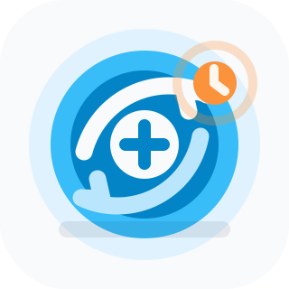

# riverpod_effects

<p align="center">
  
</p>

One-time side effects for Riverpod notifiers.

Use `riverpod_effects` for UI events that should not live in notifier state:
navigation, snackbars, dialogs, permission prompts, haptics, analytics triggers,
and similar ephemeral actions.

Effects are delivered through a stream, so they do not rebuild widgets and they
are cleaned up automatically with the notifier lifecycle.

---

## Requirements

- Dart SDK `>=3.8.0 <4.0.0`
- Flutter SDK `>=3.32.0`
- Riverpod `^3.0.3`
- Platforms: Android, iOS, Linux, macOS, Web, Windows

---

## Maintainer

Baburam Nabik

---

## Install

```yaml
dependencies:
  riverpod_effects: ^1.0.0
```

If your UI uses `ConsumerWidget`, `ConsumerStatefulWidget`, or `WidgetRef`, also
add `flutter_riverpod` in your app.

---

## Quick Start

### 1. Define Effects

Effects are plain Dart classes. A sealed hierarchy keeps UI handling exhaustive.

```dart
import 'package:riverpod_effects/riverpod_effects.dart';

sealed class LoginEffect extends UiEffect {
  const LoginEffect();
}

class ShowSnackBar extends LoginEffect {
  final String message;

  const ShowSnackBar(this.message);
}

class NavigateHome extends LoginEffect {
  const NavigateHome();
}
```

### 2. Emit Effects From a Notifier

Add `EffectMixin<EffectType, StateType>` to a generated Riverpod notifier.
The same mixin works with both sync `Notifier<T>` and `AsyncNotifier<T>`
classes.

```dart
import 'package:riverpod_annotation/riverpod_annotation.dart';
import 'package:riverpod_effects/riverpod_effects.dart';

part 'login_view_model.g.dart';

@riverpod
class LoginViewModel extends _$LoginViewModel
    with EffectMixin<LoginEffect, LoginState> {
  @override
  LoginState build() => const LoginState();

  Future<void> login() async {
    state = state.copyWith(isLoading: true);

    final success = await authenticate(state.username, state.password);

    state = state.copyWith(isLoading: false);

    if (success) {
      emitEffect(const ShowSnackBar('Login successful'));
      emitEffect(const NavigateHome());
    } else {
      emitEffect(const ShowSnackBar('Invalid credentials'));
    }
  }
}
```

The second type parameter must match the notifier state type:

- For `Notifier<LoginState>`, use `EffectMixin<LoginEffect, LoginState>`.
- For `AsyncNotifier<User>`, use `EffectMixin<MyEffect, User>`.

### 3. Handle Effects in the UI

Use `EffectConsumer` when the same widget both listens to effects and builds UI.

```dart
import 'package:flutter/material.dart';
import 'package:flutter_riverpod/flutter_riverpod.dart';
import 'package:go_router/go_router.dart';
import 'package:riverpod_effects/riverpod_effects.dart';

class LoginPage extends ConsumerWidget {
  const LoginPage({super.key});

  @override
  Widget build(BuildContext context, WidgetRef ref) {
    final state = ref.watch(loginViewModelProvider);
    final notifier = ref.read(loginViewModelProvider.notifier);

    return EffectConsumer<LoginEffect>(
      stream: notifier.effects,
      listener: (context, effect) {
        switch (effect) {
          case NavigateHome():
            context.go('/home');
          case ShowSnackBar(message: final message):
            ScaffoldMessenger.of(context).showSnackBar(
              SnackBar(content: Text(message)),
            );
        }
      },
      builder: (context) {
        return ElevatedButton(
          onPressed: state.isLoading ? null : notifier.login,
          child: const Text('Login'),
        );
      },
    );
  }
}
```

Read the notifier with `ref.read(provider.notifier)` for the effect stream. Watch
the provider state separately with `ref.watch(provider)`.

---

## API Overview

| API | Purpose |
| --- | --- |
| `UiEffect` | Base class for app-defined effects. |
| `EffectMixin<E, T>` | Adds `effects`, `emitEffect`, `hasListener`, `listen`, and automatic disposal to both `Notifier<T>` and `AsyncNotifier<T>`. |
| `EffectsNotifier<E, T>` | Base class for a sync `Notifier<T>` with effect support already mixed in. |
| `AsyncEffectsNotifier<E, T>` | Base class for an `AsyncNotifier<T>` with effect support already mixed in. |
| `EffectConsumer<E>` | Widget that subscribes to an effect stream and builds a subtree. |
| `EffectListener<E>` | Lower-level widget that subscribes to an effect stream around an existing child. |
| `EffectEmitter<E>` | Standalone stream emitter used internally by the mixin and available for custom use. |
| `EffectNotifier<E>` | Interface for objects exposing a `Stream<E> get effects`. |

---

## Notifier Usage

`EffectMixin` is the primary API and can be mixed into both generated sync
notifiers and generated async notifiers. The `EffectsNotifier` and
`AsyncEffectsNotifier` base classes are convenience options for manual providers.

### Generated Sync Notifier

```dart
@riverpod
class CounterViewModel extends _$CounterViewModel
    with EffectMixin<CounterEffect, int> {
  @override
  int build() => 0;

  void increment() {
    state++;
    emitEffect(const CounterEffect.changed());
  }
}
```

### Generated Async Notifier

```dart
@riverpod
class ProfileViewModel extends _$ProfileViewModel
    with EffectMixin<ProfileEffect, Profile> {
  @override
  Future<Profile> build() => fetchProfile();

  Future<void> refreshProfile() async {
    state = const AsyncLoading();
    state = await AsyncValue.guard(fetchProfile);
    emitEffect(const ProfileEffect.refreshed());
  }
}
```

### Manual Provider With `EffectsNotifier`

Use `EffectsNotifier` when you are not using code generation.

```dart
import 'package:riverpod/riverpod.dart';
import 'package:riverpod_effects/riverpod_effects.dart';

final counterProvider = NotifierProvider<CounterNotifier, int>(
  CounterNotifier.new,
);

class CounterNotifier extends EffectsNotifier<CounterEffect, int> {
  @override
  int build() => 0;

  void increment() {
    state++;
    emitEffect(const CounterEffect.changed());
  }
}
```

### Manual Provider With `AsyncEffectsNotifier`

```dart
final profileProvider =
    AsyncNotifierProvider<ProfileNotifier, Profile>(ProfileNotifier.new);

class ProfileNotifier extends AsyncEffectsNotifier<ProfileEffect, Profile> {
  @override
  Future<Profile> build() => fetchProfile();

  Future<void> refreshProfile() async {
    state = const AsyncLoading();
    state = await AsyncValue.guard(fetchProfile);
    emitEffect(const ProfileEffect.refreshed());
  }
}
```

---

## Widget Usage

### `EffectConsumer`

`EffectConsumer` is the usual choice for pages and feature widgets.

```dart
EffectConsumer<LoginEffect>(
  stream: ref.read(loginViewModelProvider.notifier).effects,
  listener: (context, effect) {
    switch (effect) {
      case ShowSnackBar(message: final message):
        ScaffoldMessenger.of(context).showSnackBar(
          SnackBar(content: Text(message)),
        );
      case NavigateHome():
        context.go('/home');
    }
  },
  builder: (context) => const LoginForm(),
);
```

### `EffectListener`

Use `EffectListener` when you already have a child widget and only need to wrap
it with an effect subscription.

```dart
EffectListener<LoginEffect>(
  stream: ref.read(loginViewModelProvider.notifier).effects,
  listener: (context, effect) {
    if (effect case ShowSnackBar(message: final message)) {
      ScaffoldMessenger.of(context).showSnackBar(
        SnackBar(content: Text(message)),
      );
    }
  },
  child: const LoginForm(),
);
```

`EffectListener` subscribes in `initState`, resubscribes when the `stream`
instance changes, cancels in `dispose`, and reports stream errors through
`FlutterError.reportError`.

---

## Replay

By default, effects emitted before a listener subscribes are not delivered to
that listener. Enable replay when late subscribers should receive the most
recent effects.

```dart
class LoginViewModel extends _$LoginViewModel
    with EffectMixin<LoginEffect, LoginState> {
  @override
  LoginState build() => const LoginState();

  @override
  EffectEmitter<LoginEffect> createEffectEmitter() {
    return EffectEmitter<LoginEffect>(replay: 1);
  }
}
```

Replay behavior:

- `replay: 0` is the default and stores no past effects.
- `replay: 1` stores the latest effect.
- `replay: 5` stores the latest five effects.
- Replayed streams are broadcast streams, so multiple listeners can subscribe.
- Effects are delivered in FIFO order.

Use replay sparingly. Most UI events, especially navigation, should usually be
handled only by listeners that are currently mounted.

---

## Non-Widget Listeners

Use `listen` when another service, test, or notifier needs to observe effects.
Cancel the subscription when it is no longer needed.

```dart
final notifier = container.read(loginViewModelProvider.notifier);

final subscription = notifier.listen(
  (effect) {
    // Handle the effect.
  },
  onError: (error, stackTrace) {
    // Optional stream error handling.
  },
);

await subscription.cancel();
```

---

## Standalone `EffectEmitter`

You can use `EffectEmitter` directly outside Riverpod when you only need a small
broadcast effect stream.

```dart
final emitter = EffectEmitter<LoginEffect>(replay: 2);

final subscription = emitter.listen((effect) {
  // Handle effect.
});

emitter.emit(const ShowSnackBar('Saved'));

await subscription.cancel();
emitter.dispose();
```

`emit` is a no-op after `dispose`, which makes cleanup-safe calls harmless.

---

## Lifecycle and Delivery Guarantees

- Effects are separate from state and never trigger provider rebuilds by
  themselves.
- Each active listener receives each emitted effect once.
- Multiple active listeners each receive the same emitted effect.
- Effects are delivered in the order they are emitted.
- The emitter is created lazily on first use.
- `EffectMixin` registers emitter disposal with `ref.onDispose`.
- `hasListener` is `true` when at least one listener is currently subscribed.
- Widget listeners catch stream errors and report them with `FlutterError`.

---

## Common Patterns

### Avoid Storing Effects in State

Prefer this:

```dart
emitEffect(const ShowSnackBar('Saved'));
```

Instead of this:

```dart
state = state.copyWith(snackBarMessage: 'Saved');
```

State should represent durable UI data. Effects should represent one-time
actions.

### Check for Active Listeners

```dart
if (hasListener) {
  emitEffect(const StartExpensiveUiWork());
}
```

This is optional. Most effects can be emitted without checking.

### Keep Effects UI-Focused

Effects should describe what happened or what the UI should do:

```dart
emitEffect(const NavigateHome());
emitEffect(const ShowSnackBar('Saved'));
emitEffect(const RequestCameraPermission());
```

Avoid putting long-running business logic in an effect listener.

---

## Example App

A complete runnable example is in [`example/`](example/).

```bash
cd example
flutter run
```

Enter `admin` / `admin` to see a snackbar and navigate to the home screen.

---

## License

MIT
